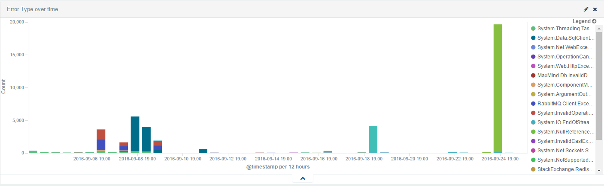
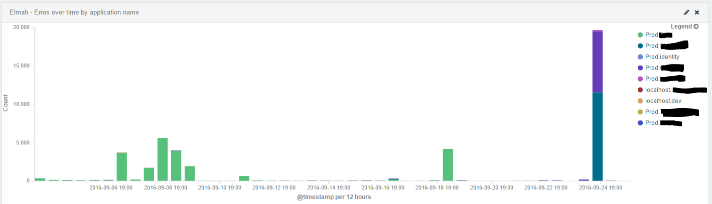
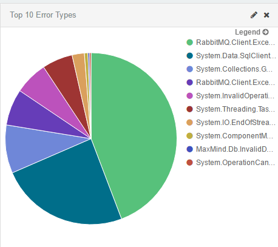

# Elmah.Io.ElasticSearch
Elmah.Io.ElasticSearch is an Elasticsearch storage backend for ELMAH.

[](https://ci.appveyor.com/project/jayhilden/elmah-io-elasticsearch/branch/master)
[](https://www.nuget.org/packages/Elmah.ElasticSearch)

# Release 2.0 is finally here!  
### [Release Notes](https://github.com/elmahio/Elmah.Io.ElasticSearch/wiki/1.2-Release-Notes)
**Note: Release 2.0 is not compatible with ElasticSearch 1.x  If you are still using 1.x then please install version 1.2.0.13 [here](https://www.nuget.org/packages/Elmah.ElasticSearch/1.2.0.31).**

## Create amazing graphs and dashboards with Kibana







## QuickStart
Elmah.Io.ElasticSearch is configured like other implementations for Elmah. To get started, add the following to your web.config or app.config:

#### 1. Connection String & `<elmah>` configuration section
```
    <connectionStrings>
        <add name="ElmahElasticSearch" connectionString="Nodes=http://localhost:9200;DefaultIndex=elmah;Username=elmahUser;Password=elmahPass" />
    </connectionStrings>
    <elmah>
        <errorLog type="Elmah.Io.ElasticSearch.ElasticSearchErrorLog, Elmah.Io.ElasticSearch"
        connectionStringName="ElmahElasticSearch" />
    </elmah>
```

## Configuration
The ElasticSearch connection string supports the following information:

#### 1. Specify Node URL(s)
A list of 1 to N Nodes - This is a comma separated list of nodes for your ES cluster.
Example of a single node:
```
        <add name="ElmahElasticSearch" connectionString="Nodes=http://localhost:9200;DefaultIndex=elmah" />
```
Example of specifying 3 nodes:
```
<connectionStrings>
    <add name="ElmahElasticSearch" connectionString="Nodes=http://localhost:9200,http://server2:9200, http://server3:9200;DefaultIndex=elmah" />
</connectionStrings>
```

#### 2. Specify Default index
The default index for Elmah can be specified as a static index.

In this example the index has the name "elmahIndex1"
```
<connectionStrings>
    <add name="ElmahElasticSearch" connectionString="Nodes=http://localhost:9200,http://server2:9200, http://server3:9200;DefaultIndex=elmahIndex1;" />
</connectionStrings>
```

The index can also be specified as a **rolling index**.  In the example below the index uses the current day, month, and year.
```
<connectionStrings>
    <add name="ElmahElasticSearch" connectionString="Nodes=http://localhost:9200,http://server2:9200, http://server3:9200;DefaultIndex=elmah-${yyyy.MM.dd};" />
</connectionStrings>
```

#### 3. Specify a username and password for use with ElasticSearch Shield.
```
<connectionStrings>
    <add name="ElmahElasticSearch" connectionString="Nodes=http://localhost:9200,http://server2:9200, http://server3:9200;DefaultIndex=elmah;Username=elmahUser;Password=elmahPass" />
</connectionStrings>
```

When using ES Shield here are the recommended settings for a user role with the name 'elmah'
```
elmah:
  indices:
    'elmah':
      privileges: read, index, indices:admin/get, indices:admin/exists, indices:admin/mapping/put, create_index
```
The user needs to be able to check if the index exists and if it does not exist it needs to be able to create the index plus apply the mapping.

#### 4. `<elmah>` configuration
```
  <elmah>
    <errorLog
        type="Elmah.Io.ElasticSearch.ElasticSearchErrorLog, Elmah.Io.ElasticSearch, Version=1.0.0.0, Culture=neutral"
        connectionStringName="ElmahElasticSearch"
        applicationName="ElmahElasticSearchSampleWebsite"
        environmentName="development"
        customerName="sample customer"
        />
    <security allowRemoteAccess="false" />
  </elmah>
```

In the example above you can see the following optional fields have been specified:

1. Application Name
2. Environment Name
3. Customer Name

You can see a sample web.config that has both the `<elmah>` configuration and the connection string [here] (Elmah.Io.ElasticSearch.Web/Web.config)


## Retreiving raw data
To get the data from Elastic, run the following:
```
GET elmah/error/_search
{
  "query": {
    "match_all": {}
  }
}
```

Sample Result:
```
{
   "took": 4,
   "timed_out": false,
   "_shards": {
      "total": 5,
      "successful": 5,
      "failed": 0
   },
   "hits": {
      "total": 1,
      "max_score": 1,
      "hits": [
         {
            "_index": "elmah",
            "_type": "error",
            "_id": "AUwupDKg5dFjuaEj8ID-",
            "_score": 1,
            "_source": {
               "errorXml": "<some xml/>",
               "applicationName": "ElmahElasticSearchSampleWebsite",
               "hostName": "VB-133",
               "type": "System.Web.HttpException",
               "source": "System.Web.Mvc",
               "message": "The controller for path '/asdfdsaf' was not found or does not implement IController.",
               "detail": "System.Web.HttpException (0x80004005): The controller for path '/asdfdsaf' was not found or does not implement IController.",
               "user": "",
               "@timestamp": "2015-03-18T15:47:35.0322548-05:00",
               "statusCode": 404,
               "webHostHtmlMessage": "",
               "environmentName": "development",
               "customerName": "sample customer"
            }
         }
      ]
   }
}
```
